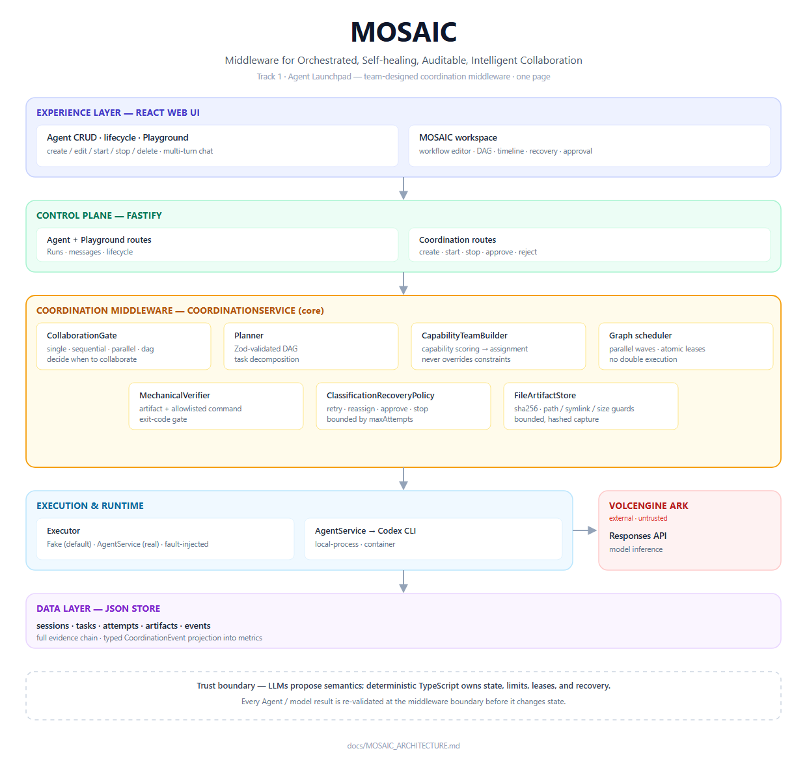
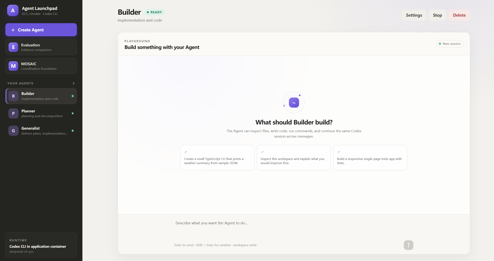
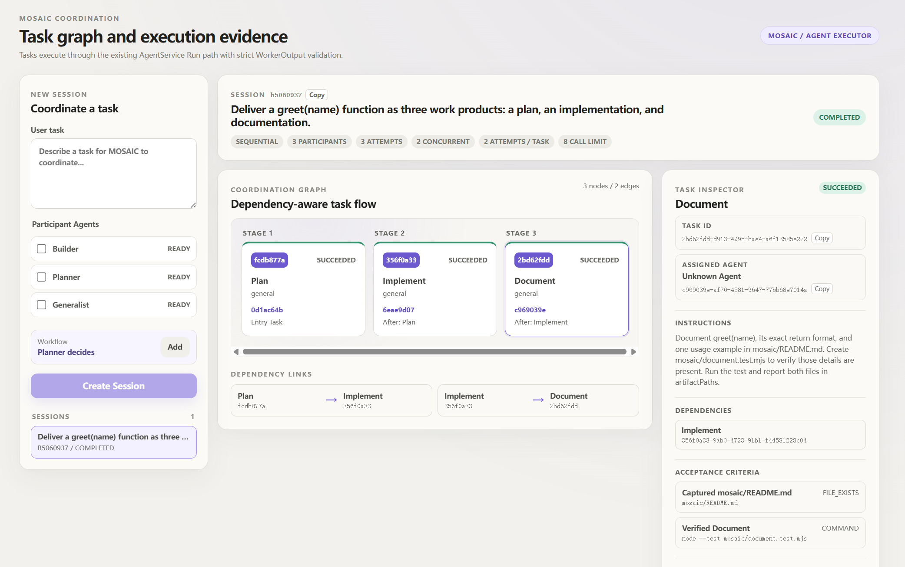
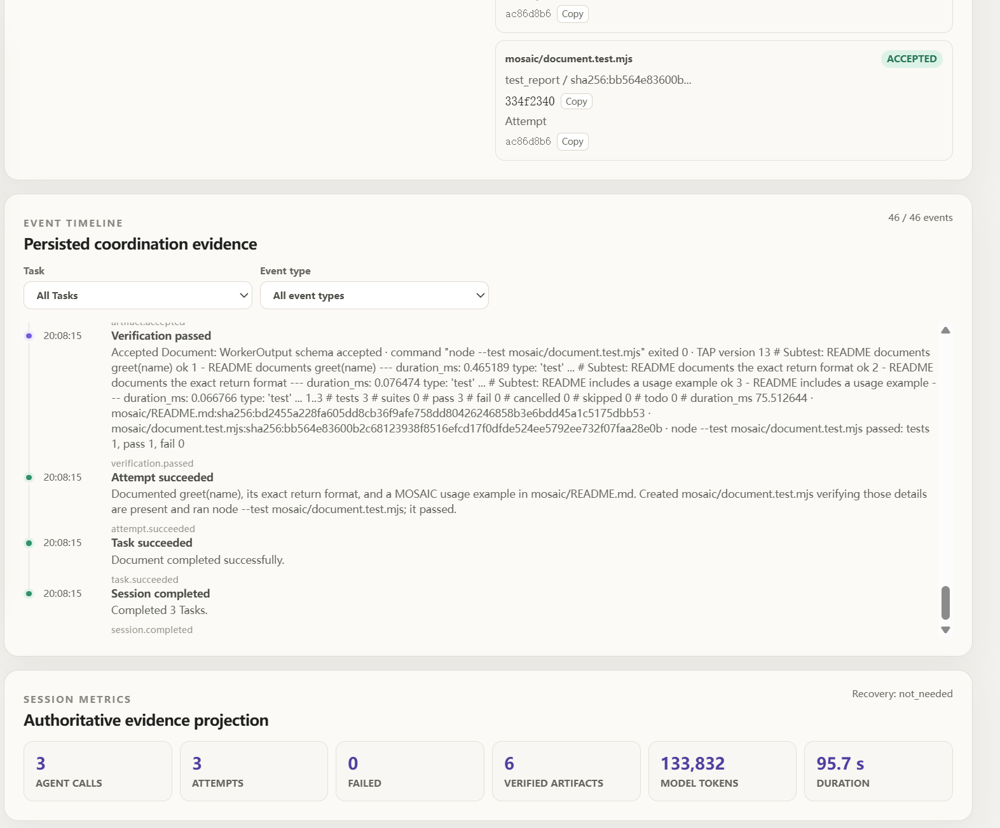

# MOSAIC

MOSAIC (Middleware for Orchestrated, Self-healing, Auditable, Intelligent
Collaboration) is the team-designed middleware story for Track 1 "Agent
Launchpad". The Starter Kit runs **one** Agent per Playground turn; MOSAIC
coordinates **several** Agents through a shared, auditable plan.

**Problem.** A single Agent is not enough when a request decomposes into
independent work items, when a task fails and needs a bounded retry or a
different Agent, or when a human must approve a risky step. The platform had no
way to plan, assign, verify, and recover multi-Agent work.

**Design.** LLMs provide semantics (planning, judging); deterministic
TypeScript owns state, limits, leases, and recovery:

- **Collaboration Gate + Planner** choose a topology
  (`single` / `sequential` / `parallel` / `dag`) and emit a Zod-validated DAG.
- **Capability-based team builder** assigns each Task to the best-matching
  Agent by capability keywords, falling back to participant order.
- **Parallel graph scheduler** runs ready Tasks concurrently up to a budget,
  with atomic `pending → ready → leased` transitions (no double execution).
- **Mechanical verifier** checks WorkerOutput and, in Agent mode, allowlisted
  commands (`npm test`, `npm run build`, …) in the producer workspace.
- **Classification recovery** maps a failure class to a targeted action: retry
  transient/malformed failures, reassign timeouts and capability mismatches,
  spawn a **repair** Task for acceptance failures, **re-plan** the unfinished
  subgraph on no-progress, pause for **human approval** when opted in, or stop —
  all bounded by `maxAttemptsPerTask`.
- **Structured constraint workflows** accept a `workflow` field (ordered tasks,
  explicit `assignedAgentId`, and `turnTaking` round-robin) so the team builder
  never overrides a user's assignment.
- **Workflow authoring UI** lets users define Task keys, dependencies,
  capabilities, fixed Agent assignments, round-robin routing, result files, and
  allowlisted verification commands before creating a Session.
- **Safe artifact capture** writes files with path/symlink/size guards and
  sha256 content hashing.
- **Event + metrics projection** persists the whole chain for the timeline,
  DAG, and verification views.

## MOSAIC Architecture



See [the one-page MOSAIC architecture diagram](docs/MOSAIC_ARCHITECTURE.md)
for the full information of coordination data flow, trust boundaries, verification point, and
recovery path.

## MOSAIC Screenshots

#### Playground

#### Panels

#### Statistics



### Demo without Ark (Fake executor)

No API key or container engine required — the Fake executor drives the full
control-plane path:

```bash
npm install
npm run dev                # server on :3000, web on :5173
# open http://localhost:5173 → MOSAIC → create a session → Start
```

In the New Session panel, select the participant Agents and choose **Add** under
Workflow to replace heuristic planning with an explicit execution contract.
Every authored Task includes a captured result file and an allowlisted command
(`npm test`, `npm run test|build|check`, `npx vitest run`, or `node --test`) so
Agent-mode completion has mechanical evidence. Enable **Round-robin routing**
to alternate Tasks in the displayed participant order. A fixed Task assignment
takes precedence over round-robin routing.

- `Build several independent modules` produces a **parallel** DAG.
- To watch a failure auto-recover (retry/reassign): restart with
  `COORDINATION_DEMO_FAULT=transient`, then run `node scripts/demo-recovery.mjs`.
- To watch self-healing (repair / replan): restart with
  `COORDINATION_DEMO_FAULT=test_failure` or `COORDINATION_DEMO_FAULT=no_progress`,
  then run `node scripts/demo-repair-replan.mjs repair` or `… replan`.
- To watch human approval: restart with `COORDINATION_DEMO_FAULT=test_failure`
  and `COORDINATION_TEST_FAILURE_ACTION=request_approval`, then run
  `node scripts/demo-approval.mjs` (or Approve/Reject from the UI).
- To compare strategies and export evidence, run `node scripts/evaluate.mjs`
  (or `node scripts/evaluate.mjs --fixture` for a schema-valid sample without a
  server).

### Demo with real Agents

```bash
cp .env.example .env        # fill ARK_API_KEY + ARK_MODEL, set COORDINATION_EXECUTOR=agent
npm run dev -w @launchpad/server
node scripts/integration-real-agents.mjs
```

### Known limitations

- Coordination is single-process on the shared JSON store (no cross-process resume).
- The default heuristic planner emits only `artifact`/`worker-output` criteria,
  so allowlisted command verification runs only when a plan requests a `command`.
- `manual_review` criteria are not yet semantically reviewed by an LLM.
- Artifacts are captured only when an Agent actually reports `artifactPaths`.
- Re-plan (on `no_progress`) re-derives a plan from `userTask`; it does not
  replay the original `workflow` shape, so a structured workflow that hits
  no-progress is re-planned heuristically rather than reconstructed task-for-task.
- Playground isolation is forward-only: runs from before the `purpose` field
  existed are treated as Playground and are not rewritten.

### Future work

Given more time we would:

- Replay the original `workflow` shape on re-plan instead of re-deriving it
  heuristically, so constrained workflows recover task-for-task.
- Add semantic (LLM-judge) review for `manual_review` acceptance criteria, with
  mechanical checks always taking priority.
- Persist coordination sessions across process restarts (the store is currently
  single-process).
- Expose the full coordination trace through a machine-readable query/export API.
- Run the evaluation harness against real Ark executions, not only the fixture
  sample.

## Validation

```bash
npm run check
terraform fmt -check -recursive deploy/volcengine
docker compose config
```

With the application running, verify the MOSAIC browser/API path with
`npm run verify:mosaic`. Agent executor mode also requires
`MOSAIC_AGENT_IDS=id1,id2`.

## MOSAIC Documentation

- [MOSAIC architecture (one page)](docs/MOSAIC_ARCHITECTURE.md)
- [MOSAIC evaluation format](docs/MOSAIC_EVALUATION_FORMAT.md)
- [MOSAIC evaluation JSON Schema](docs/evaluation/mosaic-evaluation.schema.json)

## Team

Built by three developers with a backend / frontend / evidence split.

| Member | Focus | Contribution |
| --- | --- | --- |
| Zhou Zihan | Backend | Coordination control plane (session/task/event contracts, DAG validation, scheduler), Agent execution and Playground isolation, artifact capture and mechanical verification, failure classification and repair/re-plan recovery. |
| Dai Chuxin | Frontend | React coordination UI — session creation, DAG/timeline/attempt views, recovery and evidence panels, isolated Playground rendering. |
| Xperiamol | Evaluation & demo | Single/static/MOSAIC evaluation harness, demo scripts and fixtures, documentation and architecture diagram, demo recording. |

## License

[MIT](LICENSE)

------

## Starter Kit Foundation

MOSAIC extends the Volc Agent Launchpad Starter Kit, which provides Agent CRUD,
lifecycle controls, the browser Playground, persistent workspaces, Codex CLI
execution, Ark model integration, and local Docker, Colima, or Podman runtime
support. The Starter Kit is a single-user proof of concept; do not use
production data or credentials. See [SECURITY.md](SECURITY.md).

## Requirements and Quick Start

- Node.js 22+
- npm 10+
- Docker, Colima, or Podman
- A Volcengine Ark API key and Responses-compatible endpoint

For the recommended local Docker path:

```bash
cp .env.example .env
# Set ARK_API_KEY, ARK_MODEL, and a 24+ character APP_AUTH_TOKEN.
docker compose up --build
```

Open <http://localhost:3000>. Stop the application without deleting persisted
Agent data:

```bash
docker compose down
```

For local development without Docker:

```bash
npm install
cp .env.example .env
npm run dev
```

The Web UI runs at <http://localhost:5173> and the API at
<http://localhost:3000>. See [Local POC](docs/LOCAL_POC.md) for supported
runtime details and [Deployment](docs/DEPLOYMENT.md) for ECS and Terraform
paths.

## Validation

```bash
npm run check
docker compose config
```

## Starter Kit Documentation

- [Architecture](docs/ARCHITECTURE.md)
- [Local Docker, Colima, and Podman setup](docs/LOCAL_POC.md)
- [Deployment](docs/DEPLOYMENT.md)
- [Security policy](SECURITY.md)
- [Contributing](CONTRIBUTING.md)
