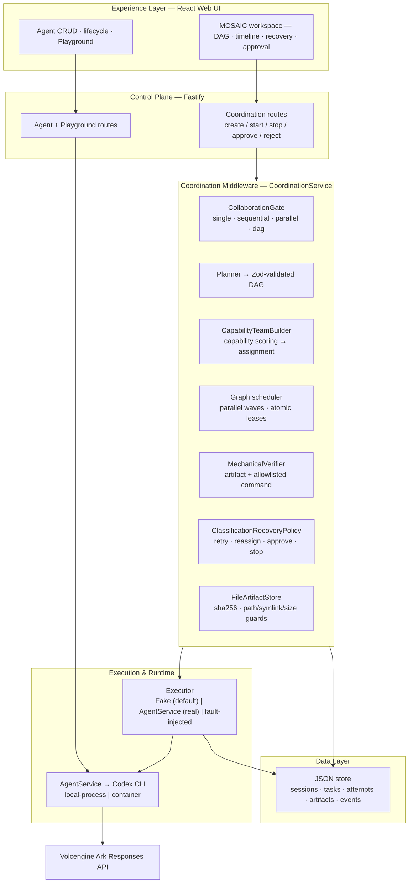
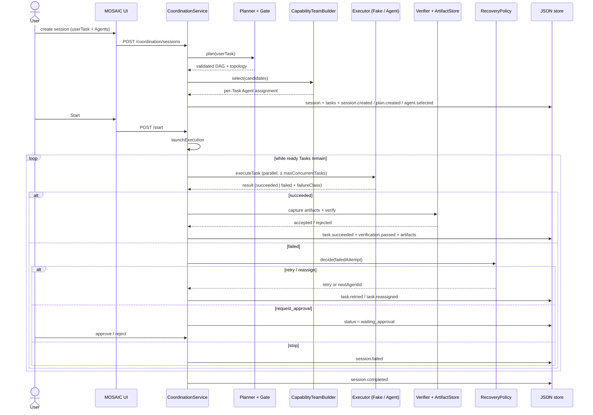

# MOSAIC Architecture — one page

**MOSAIC** — Middleware for Orchestrated, Self-healing, Auditable, Intelligent
Collaboration. The team-designed middleware for Track 1 "Agent Launchpad".

The Starter Kit runs **one** Agent per Playground turn. MOSAIC adds the missing
coordination boundary: it plans multi-Agent work as a validated DAG, assigns
Tasks to the best-matching Agents, executes ready Tasks in parallel, verifies
each result, and recovers from failure through bounded retry, reassignment, or
human approval — while persisting the full evidence chain.

## Layered architecture

The left column (Experience → Control Plane → Middleware → Data) is the trusted,
deterministic TypeScript path. The Agent Runtime and Ark model sit on the right
and are treated as untrusted: every result they produce is re-validated at the
middleware boundary before it changes state.

## Session data flow

## Trust boundaries & enforcement points

LLMs only propose semantics; deterministic code owns state, limits, leases, and
recovery.

| Boundary | What crosses it | Enforcement |
| --- | --- | --- |
| Model → control plane | Plan, assignment, recovery proposals | Zod schemas + `validatePlannerOutput` / `validateTeamBuilderOutput` / `validateRecoveryDecision` |
| Concurrency | Ready-Task leases | Atomic `pending → ready → leased` store transitions (409 on conflict); `maxConcurrentTasks` budget |
| Agent workspace → coordination store | Artifact files | `FileArtifactStore`: `realpath` + symlink/file check, path-escape rejection, per-file/attempt size caps, sha256 hash |
| Coordination → host | Commands in `command` criteria | `MechanicalVerifier` allowlist regexes (`npm test`, `npm run build`, …) + exit-code gate; no runner ⇒ rejected |
| Failure → recovery | `failureClass` | `classifyExecutionFailure` → `ClassificationRecoveryPolicy`: retry / reassign-to-different-Agent / `request_approval` / stop, bounded by `maxAttemptsPerTask` |
| Budgets | Tasks, attempts, events | `maxTasks`, `maxConcurrentTasks`, `maxAttemptsPerTask`, `maxEvents` enforced in `CoordinationService` / `CoordinationStore` |

## Evidence & instrumentation

Every transition is recorded as a typed `CoordinationEvent`
(`session.*`, `task.*`, `attempt.*`, `verification.*`, `recovery.decided`,
`task.retried`, `task.reassigned`, `session.approved`, `session.rejected`, …)
and projected into metrics (`totalAttempts`, `failedAttempts`, `retryAttempts`,
`recoveredTasks`, `acceptedArtifacts`, `recoveryStatus`). The MOSAIC workspace
renders the DAG, event timeline, per-Task evidence, and recovery/approval panel
from these records — never from fabricated execution state.

## Known limitations

- Single-process: coordination shares the baseline JSON store (no cross-process resume).
- The current heuristic Planner generates generic topology templates and does not
  yet compile exact user-specified ordering, fixed Agent assignments, or
  turn-taking protocols into a DAG. The documented two-Agent alternating-count
  acceptance scenario therefore requires control-plane work before it is usable.
- The heuristic planner emits only `artifact`/`worker-output` criteria; allowlisted
  command verification runs only when a plan explicitly requests a `command` criterion.
- `manual_review` criteria are not yet semantically reviewed by an LLM.
- Artifacts are captured only when an Agent actually reports `artifactPaths`.
